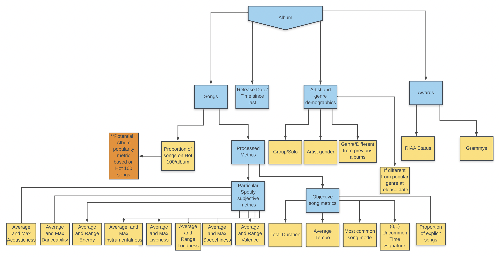
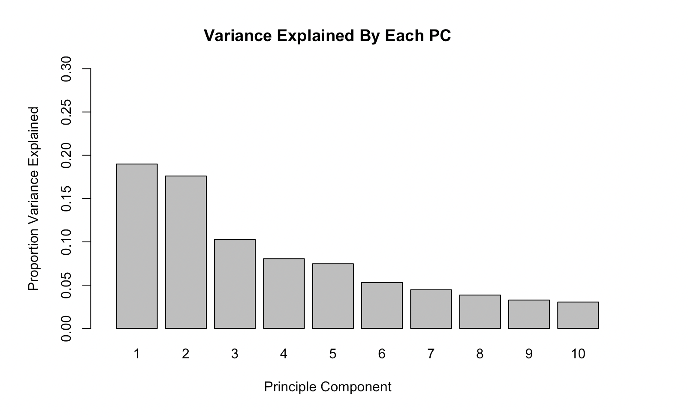
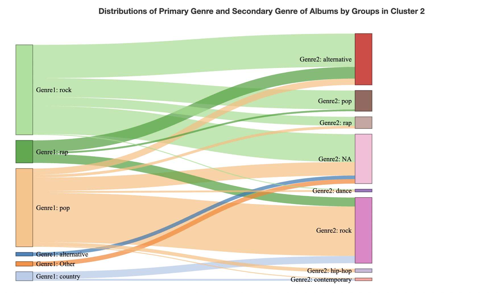
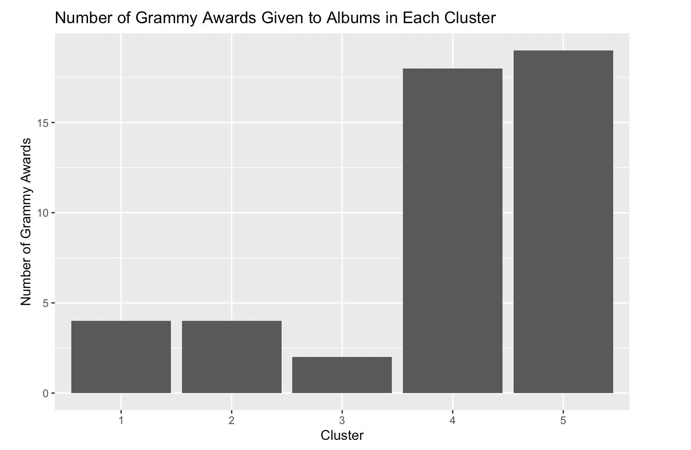

# MusicArtistArchetypes
## Description
This was my senior project advised on by Professor Kelly Bodwin at Cal Poly SLO in Winter 2019. The project aimed to group albums using unsupervised clustering. All studio and live albums by artists who appeared on the Billboard Hot 100 in between 1999 and 2019 were considered in the exploration. We conducted various iterations of Principal Component Analysis, and ran K-means with different levels of K to attempt to best separate the data. Once the clusters were made, we could infer on what factors the model was separating groups by and then see if any of those groups aligned with traditional music genres. The html report in "MarkdownKnittedOutputs" gives detailed results. 

All data scraping was done using Python in Jupyter Notebooks, and all analysis was done using R. 

## File and Folder Descriptions 
- MarkdownKnittedOutputs: Contains HTML output of the reports (versions with and without appendix)
- Scrapers: Contains the notebooks used to scrape data used for the analysis
  - BillboardScraping(Charlie).ipynb: File largely authored by a previous student of the advisor, I added onto it to add more cleaning functionality, turn some items to functions, and get writing credits
  - Cleaning(Charlie).ipynb: File largely authored by a previous student of the advisor, I added onto it to add more cleaning functionality
  - OtherScrapingFrost.ipynb: Data scraper which gets data from the Grammys, Spotify, RIAA, and ultimate-guitar.com. Not all of this data is used in this project, as it was purposed for a tangent project. 
  - SpotifyClientLinker.ipynb: API calling notebook to get data from Spotify. You will need personal API credentials to use for yourself. 
  - chromedriver: The Selenium required executable to do automated web navigation
- frostFunctions.R: an R script containing all the function definitions and comment descriptions used in the analysis files
- AlbumClustering.Rmd: Main analysis file used to knit the output reports
- AlbumDataGetter.Rmd: Data cleaning and subsetting file
- WhatMakesUpAnAlbumFinal.pdf: Schema of fields which were included in the analysis



## Analysis and Basic Findings
The exploration aimed to simply compare and contrast albums in the data, ultimately through the use of unsupervised learning. Once clusters were formed, we speculated on what some of the features of the derived clusters were and then answered some targeted research questions. The questions that were asked and addressed were: 
1. What are the rock albums in the ‘rap cluster’, and why are they there?
2. What is characteristic of the cluster with the highest proportion of female artists? What genres are being covered by these female artists in this cluster high in acousticness?
3. What are the genres being covered by all of these male groups in the cluster with the far greater group density?
4. Are there any demographic details that help understand the differences between the 2 clusters with high scores for liveness?
5. Are there differences in the distribution of Grammy Awards across clusters?

The full analysis ```MarkdownKnittedOutputs/AlbumClustering.html``` answers these questions and gives full research conntext. Here is a sample of the derived visuals used in explaining methodology.

<br>
<br>

<br>
<br>



## Potential Next Steps
As far as next steps for this project, one could enrich the data on artists based on how their albums were clustered in the current iteration of this project, then they could run PCA and K-means clustering on the artists themselves to see how this information would influence a model to group artists. 
